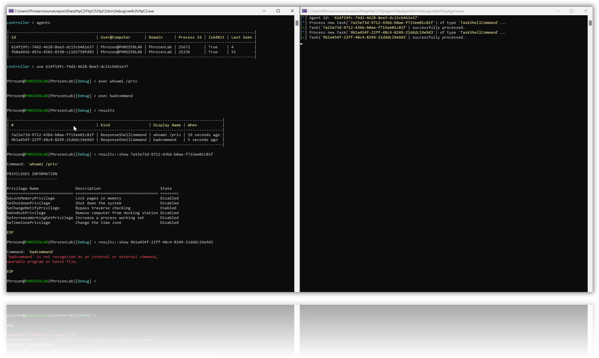

# SharpFtpC2 (PoC)

SharpFtpC2 is a small, experimental project aimed at exploring the possibility of using FTP(S) for relaying commands and responses between two remote computers. It employs the FTP protocol as a makeshift tunnel through which the computers, both acting as clients connected to an FTP server, can communicate. A simple session management scheme is used to keep track of the exchange of requests and responses.

SharpFtpC2 employs a basic session management system. Although quite elementary, it serves the purpose of keeping the communications synchronized and related, which is essential for the back-and-forth between the remote systems.

⚠️ Please note that SharpFtpC2 is very much in the early stages of development. It lacks critical security features like data encryption to protect transmitted data integrity and confidentiality. Therefore, it's not at all meant for production use or any environment where security is a concern. It's more of a curiosity, a stepping stone, or a learning tool for those intrigued by network communication.

If you have an interest in the nitty-gritty of network communication, or just want to fiddle with C# and .NET Core, SharpFtpC2 might be an intriguing starting point. Don't expect a polished gem, but maybe, just maybe, you might learn something interesting from tinkering with it.

---

## The Story Behing The Project

SharpFtpC2 was born out of the desire to contribute to the [Unprotect Project](https://unprotect.it), particularly its [Network Evasion](https://unprotect.it/category/network-evasion/) category. 

This idea of using FTP as a "tunnel" has roots that run deep. In fact, it brings back fond memories from around 2005 when I was still getting my feet wet in the programming world. Back then, I crossed paths with a remarkably creative French individual who went by the moniker **BlasterWar**. He had conceived a project named **BlasterX**, which, despite being lost to time, was rather avant-garde for its era. 

BlasterWar's ingenuity in his project was to provide an alternative to the conventional reverse connection, where the agent needed to establish a connection back to the controlling or hacking device.

Instead, BlasterWar opted to use FTP (File Transfer Protocol) as the alternative medium and constructed a comprehensive Remote Access Tool around it. The Tool included features such as Screen Capture, Keylogging, and System Management, all transmitted through the FTP tunnel. At the time, FTP was widely popular and a plethora of websites offered free FTP servers to the public. This made it an ideal alternative to reverse or direct connections, which involved port forwarding. Moreover, it provided an added layer of obfuscation for the command and control (C2) as the IP address of the hacker's machine wasn't directly exposed.

Nevertheless, the use of FTP as a communication channel comes with its share of risks. One significant concern is that FTP sends credentials in plain text over the network, and necessitates both parties to have access to these credentials, making it vulnerable to an array of attacks. In response to these security concerns, FTP servers have progressively adopted encryption through FTPS (FTP Secure), which incorporates SSL/TLS. However, this measure does not fully mitigate all the associated risks.

With a touch of ingenuity and by drawing inspiration from existing protocols, it is feasible to tackle a substantial number of the existing risks. The current version of SharpFtpC2, however, does not incorporate these mitigations, and that is why it is labeled as experimental for the time being.

